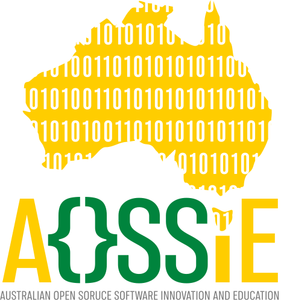

<!-- Don't delete it -->
<div name="readme-top"></div>

<!-- Organization Logo -->
<div align="center" style="display: flex; align-items: center; justify-content: center; gap: 16px;">
  
  

</div>

&nbsp;

<!-- Organization Name -->
<div align="center">

[](https://aossie.org/)

</div>

<!-- Organization/Project Social Handles -->
<p align="center">
<!-- Telegram -->
<a href="https://t.me/+bMWGzaMTMa8xN2Ex">
</a>
&nbsp;&nbsp;
<!-- X (formerly Twitter) -->
<a href="https://x.com/aossie_org">
</a>
&nbsp;&nbsp;
<!-- Discord AOSSIE-->
<a href="https://discord.gg/hjUhu33uAn">
</a>
<!-- Discord Stability Nexus-->
<a href="https://discord.gg/YzDKeEfWtS">
</a>
&nbsp;&nbsp;
<!-- LinkedIn -->
<a href="https://www.linkedin.com/company/aossie/">
  </a>
&nbsp;&nbsp;
<!-- Youtube AOSSIE-->
<a href="https://www.youtube.com/@AOSSIE-Org">
  </a>
<a href="https://www.youtube.com/@StabilityNexus">
  </a>
</p>


---

<div align="center">
<h1>PictoPy Website</h1>
</div>

[PictoPy Website](https://pictopy.aossie.org/) is the official landing page for **[PictoPy](https://github.com/AOSSIE-Org/PictoPy)**: a privacy-first, AI-powered desktop image gallery.

A high-performance, developer-friendly webpage built on **Next.js 16 (App Router)**, **React 19**, **Tailwind CSS v4**, and pre-configured for **Internationalization (i18n)** and **Localization (l10n)** using **next-intl**.

[](https://github.com/AOSSIE-Org/PictoPy-Website/actions/workflows/build-and-deploy.yaml)
[](LICENSE)

</div>

---

## About PictoPy

PictoPy is an advanced desktop gallery application that combines **Tauri**, **React**, and **Rust** for the frontend with a **Python** backend for sophisticated AI-powered image analysis and management.

It runs entirely offline, keeping your photos and their analysis private — no cloud uploads, no external servers.

---

## 🚀 PictoPy's Features

- **Smart Auto-Tagging** — automatically tags photos based on detected objects and recognized faces using YOLOv11 and FaceNet
- **Face Clustering** — groups photos by person using DBSCAN clustering on face embeddings
- **Smart Search** — find photos by objects, faces, or metadata instantly
- **Album Management** — full traditional gallery features alongside AI capabilities
- **Privacy-First** — fully offline, all processing happens locally on your machine
- **Cross-Platform** — runs on Windows, macOS, and Linux via Tauri

---

## 💻 Tech Stack

| Layer | Technology |
|---|---|
| Desktop Framework | Tauri |
| Frontend | React, TypeScript, Tailwind CSS |
| Rust Backend | Rust (file system & Tauri bridge) |
| Python Backend | FastAPI, Python |
| Object Detection | YOLOv11 |
| Face Recognition | FaceNet, ONNX Runtime |
| Face Clustering | DBSCAN |
| Database | SQLite |
| Image Processing | OpenCV |
| State Management | Redux Toolkit |

---

## 📋 Project Maturity & TODO Checklist

In the checklist below, mark the items that have been completed for your project:

* [x] The project has a logo (`public/brand/icons/pictopy_logo.svg`).
* [x] The project has a favicon (`public/brand/icons/favicon.ico`).
* [x] The web frontend:
   - [x] Has proper title and metadata.
   - [x] Has proper open graph metadata, to ensure that it is shown well when shared in social media.
   - [x] Has a footer and header with AOSSIE logos and social handles.
   - [x] Uses Next.js Server Components by default with Client Components (`"use client"`) introduced only where interactive state is required.
   - [x] Is deployed to GitHub Pages via a GitHub Workflow (`.github/workflows/nextjs.yml`).
   - [x] Has automated CI build and lint validation (`.github/workflows/ci.yml`).
   - [x] Has CodeRabbit automated AI code review (`.coderabbit.yml`).
   - [x] Has open-source legal compliance (`DCO.md`, `COPYRIGHT.md`, `Contributors.md`).

---

## 🚀 Key Features of PictoPy Website

- **Next.js 16 & React 19:** Utilizing the latest Server Components, Client Actions, and async routing paradigms.
- **Tailwind CSS v4:** Modern utility-first styling with native CSS variables and streamlined postcss integrations.
- **Dual Theme System:** Flash-free light, dark, and system preferred themes using `next-themes` and Tailwind CSS v4 custom variants.
- **Robust i18n & l10n:** Deeply integrated multi-language support:
  - Automatic locale detection based on browser preferences.
  - Subpath routing (e.g., `/hi` for Hindi, and unprefixed `/` for English as default) with clean `as-needed` URL prefixing.
  - Sleek, interactive language switcher client component.
  - Zero-bundle-size footprint for static translations using Server Components & Client `useTranslations`.
- **Developer Experience:** Strict TypeScript compilation and ES Lint setup.
- **Application Control Compatibility:** Configured with manual Webpack & Turbopack alias resolution to bypass restrictive execution environments blocking native binary compiles.
- **Open-Source Governance & CI/CD:** Integrated GitHub Actions workflows (`ci.yml`, `nextjs.yml`, `label-merge-conflicts.yml`), `.coderabbit.yml`, and `DCO.md` legal documentation.
- **AI Agent Pairing Ready:** Includes `AGENTS.md` and `CLAUDE.md` to guide AI development agents.

---

## 📂 Project Structure

Here is a breakdown of the key i18n directories and files:

```text
├── .github/
│   └── workflows/          # GitHub Actions (CI, GitHub Pages deployment, merge conflict checks)
├── next.config.ts          # Alias-wrapped Next configuration
├── public/                 # Static assets, robots.txt, assetlinks.json, llms.txt
│   ├── .well-known/
│   ├── llms.txt
│   ├── robots.txt
│   └── brand/
│       ├── Brand.md            # Official AOSSIE brand guidelines document
│       └── icons/             
│           ├── aossie_logo.svg              # AOSSIE Vector logo
│           ├── stability_nexus_logo.svg     # Vector logo
│           └── favicon.ico                  # Browser tab icon
├── src/
│   ├── config/
│   │   └── languages.ts        # Central registry of supported languages & locales
│   ├── i18n/
│   │   ├── routing.ts          # Core i18n routing parameters (locales, defaults)
│   │   ├── request.ts          # Server-side translation dictionary loading configuration
│   │   ├── metadata.ts         # Configuration data, SEO values, or reflection data for a project
│   │   └── navigation.ts       # Type-safe navigation helpers (Link, useRouter, etc.)
│   ├── messages/
│   │   ├── en.json             # English translation dictionary
│   │   └── hi.json             # Hindi translation dictionary
│   ├── app/
│   │   ├── sitemap.ts          # Dynamically generated localized sitemaps
│   │   └── [locale]/           # Localized route group
│   │       ├── layout.tsx      # Multi-lingual layout injecting client context & translations
│   │       ├── page.tsx        # Localized Landing Page ("use client")
│   │       ├── globals.css     # Global styles for the app segment
│   │       ├── error.tsx       # Localized Error Boundary page fallback
│   │       └── not-found.tsx   # Localized 404 page fallback
│   ├── components/
│   │   ├── LanguageSwitcher.tsx # Dropdown element to switch interface locales interactively
│   │   ├── ThemeToggle.tsx      # Multi-state theme switch with micro-animations
│   │   └── providers/
│   │       ├── theme-provider.tsx # Next-themes client wrapper component
│   │       └── lenis-provider.tsx # Lenis smooth scrolling provider wrapper
│   └── proxy.ts                # Next.js 16 Proxy Middleware for route and locale redirection
├── .coderabbit.yml         # Automated AI Code Review configuration
├── COPYRIGHT.md            # Copyright terms
├── Contributors.md         # Project contributors list
└── DCO.md                  # Developer Certificate of Origin
```

---

## 🛠️ Usage Guide

### 1. Adding a New Language

To add support for a new language (e.g., French - `fr`):

1. **Register the language:** Open [`src/config/languages.ts`](src/config/languages.ts) and add your new language to the `languages` array:
   ```typescript
   export const languages: Language[] = [
     { code: 'en', name: 'English', localName: 'English' },
     { code: 'hi', name: 'Hindi', localName: 'हिन्दी' },
     { code: 'fr', name: 'French', localName: 'Français' } // Add this line
   ];
   ```

2. **Create the translation catalog:** Under `src/messages/`, create a new file named `fr.json`:
   ```json
   {
     "Home": {
       "heading": "Bienvenue sur AOSSIE Webpage Starter"
     }
   }
   ```

3. That's it! Next.js and `next-intl` will automatically register the locale, add it to the routing tables, and handle redirection for visitors matching `fr` browser preferences.

---

### 2. Translating Text in Pages and Components

#### Server Components (Recommended for Static Content)
By default, server components can load translations statically without shipping translation JSONs to the client bundle:

```tsx
import { useTranslations } from 'next-intl';

export default function Section() {
  const t = useTranslations('Home');
  return <h1>{t('heading')}</h1>;
}
```

#### Client Components
If your component uses React hooks (e.g., `useState`), define it with `"use client"` and import from `next-intl`:

```tsx
"use client";

import { useTranslations } from 'next-intl';

export default function InteractiveButton() {
  const t = useTranslations('Home');
  return <button onClick={() => alert('Clicked!')}>{t('heading')}</button>;
}
```

---

### 3. Navigation Helpers

When navigating between routes, always use the locale-aware navigation helpers imported from [`src/i18n/navigation.ts`](src/i18n/navigation.ts) instead of standard `next/link` or `next/navigation`:

```tsx
import { Link } from '../../i18n/navigation';

// Will automatically resolve to /en/about or /hi/about based on active locale
<Link href="/about">About Us</Link>
```

For programmatic router navigation:
```typescript
import { useRouter, usePathname } from '../../i18n/navigation';

const router = useRouter();
const pathname = usePathname();

// Switch active locale on current page
router.replace(pathname, { locale: 'hi' });
```

---

### 4. Theme Configuration & Dual Theme Support

The starter kit uses `next-themes` combined with Tailwind CSS v4's class-based custom variants to provide a responsive and flash-free theme experience.

#### Customizing Colors

**Preffered Method**
Tailwind v4 is configured via CSS custom properties in [`src/app/[locale]/globals.css`](src/app/[locale]/globals.css). To adjust the default light and dark theme background or text colors, edit the root variables:

```css
:root {
  --background: #ffffff; /* Light theme background */
  --foreground: #121212; /* Light theme text */
}

.dark {
  --background: #0a0a0a; /* Dark theme background */
  --foreground: #f4f4f5; /* Dark theme text */
}
```

#### Using Theme Classes
To create element styles that adapt automatically to the user's selected theme, use semantic utility tokens instead of inline `dark:` utilities:

```tsx
<div className="bg-background-secondary text-foreground-primary border border-border-default">
  This card automatically transitions colors across light and dark themes.
</div>
```

---

### 5. Smooth Scrolling (Lenis)

The starter repository integrates the `lenis` library to provide smooth, high-performance inertial scrolling across all browsers.

#### Customizing Lenis Options
To configure scroll parameters (e.g., dampening velocity, custom scroll durations, or scroll directions), update the parameters passed to the `ReactLenis` component in [`lenis-provider.tsx`](src/components/providers/lenis-provider.tsx):

```tsx
<ReactLenis root options={{ lerp: 0.1, duration: 1.5, smoothWheel: true }}>
  {children}
</ReactLenis>
```

To access the active Lenis instance or bind custom scroll animations programmatically in your page components, use the `useLenis` hook:

```typescript
import { useLenis } from 'lenis/react';

const lenis = useLenis(({ scroll, limit, velocity, direction }) => {
  // Bind your scroll logic or animation timelines here
});
```

---

## ⚡ Development and Deployment

### Getting Started

Install the project dependencies:
```bash
npm install
```

Start the development server:
```bash
npm run dev
```

Open [http://localhost:3000](http://localhost:3000) to view it. The application will automatically detect your browser's language preferences and route you to `/hi` for Hindi or `/` for English (the default locale, which omits the prefix).

### Building for Production

Compile and optimize the project:
```bash
npm run build
```

This compiles optimized static pages under the `/[locale]` path and checks all TypeScript configurations.

### Running in Production

Start the optimized server:
```bash
npm run start
```

---

## ⚙️ Initial Project Setup Checklist

When bootstrapping a new project from this starter repository, complete the following `TODO` setup checklist to align the repository with your project's branding, metadata, AI agent guidelines, and hosting configurations:

### 1. Project Identity & Header Details

- **Project Title & Logo ([`README.md`](README.md))**: Update the main project header logo (`public/brand/icons/logo.svg`), title `<h1>TODO: Project Name</h1>`, project description, feature list, and tech stack.
- **AI Agent Context ([`AGENTS.md`](AGENTS.md))**: Replace `# TODO: Project Title` and add project-specific directives and rules for AI coding agents.
- **LLM Manifest ([`public/llms.txt`](public/llms.txt))**: Update `# TODO: Project Title` in the root LLM crawler policy.
- **Community & Social Links ([`Contributors.md`](Contributors.md))**: Replace the `[TODO Channel](TODO)` placeholder with your project's Discord, Telegram, or chat channel link.

### 2. Domain Names & Search Engine Crawlers

- **Sitemap Generator ([`src/app/sitemap.ts`](src/app/sitemap.ts))**: Replace the default fallback domain `https://project.aossie.org` with your project's production domain in the source code or set the `NEXT_PUBLIC_SITE_URL` environment variable at build time (e.g., in `.github/workflows/nextjs.yml` or build pipeline settings).
- **Search Crawler Rules ([`public/robots.txt`](public/robots.txt))**: Replace the sitemap URL placeholder domain `TODO 'project.aossie.org'` with your actual production domain.

### 3. Branding Guidelines & Assets

- **Logo & Favicons ([`public/brand/icons/`](public/brand/icons/))**: Replace `aossie_logo.svg` and `favicon.ico` with your organization's custom logos.
- **Brand Documentation ([`public/brand/Brand.md`](public/brand/Brand.md))**: Document your custom color hex codes, typography selections, and asset paths here to guide future developers and AI coding agents.

### 4. SEO & i18n Localization Metadata

- **Schema.org JSON-LD ([`src/app/[locale]/page.tsx`](src/app/[locale]/page.tsx))**: Locate the `jsonLd` object inside the `Home` component. Update the `publisher.name`, `publisher.url`, and `publisher.logo` fields from `TODO` placeholders to your project metadata.
- **Translation Catalogs ([`src/messages/en.json`](src/messages/en.json), [`src/messages/hi.json`](src/messages/hi.json))**: Update the `heading`, `metaTitle`, and `metaDescription` keys with your project's localized titles and descriptions.

### 5. Mobile & AI Platform Configurations

- **Android App Links ([`public/.well-known/assetlinks.json`](public/.well-known/assetlinks.json))**: Update the package name `TODO:org.aossie.starter` and insert your Android application certificate SHA-256 fingerprint (`TODO:...`).
- **AI Agent Plugins ([`public/.well-known/ai-plugin.json`](public/.well-known/ai-plugin.json))**: Replace all `TODO` placeholders for `name_for_human`, `name_for_model`, `description_for_human`, `description_for_model`, host URLs, contact emails, and legal info links.


---

## 🤝 Contributing

We welcome contributions of all kinds! To contribute:

1. Fork the repository and create your feature branch (`git checkout -b feature/AmazingFeature`).
2. Commit your changes (`git commit -m 'Add some AmazingFeature'`).
3. Ensure code quality:
   - `npm run lint`
   - `npm run build`
4. Push your branch (`git push origin feature/AmazingFeature`).
5. Open a Pull Request for review.

© 2026 AOSSIE. Released under the Apache 2.0 / Open Source License.
